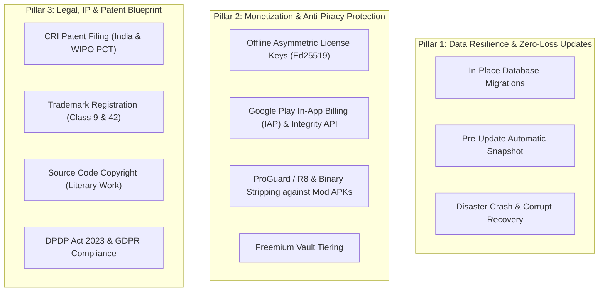
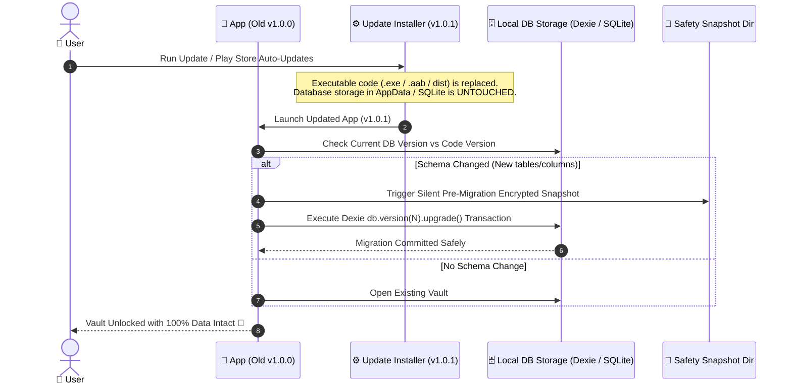
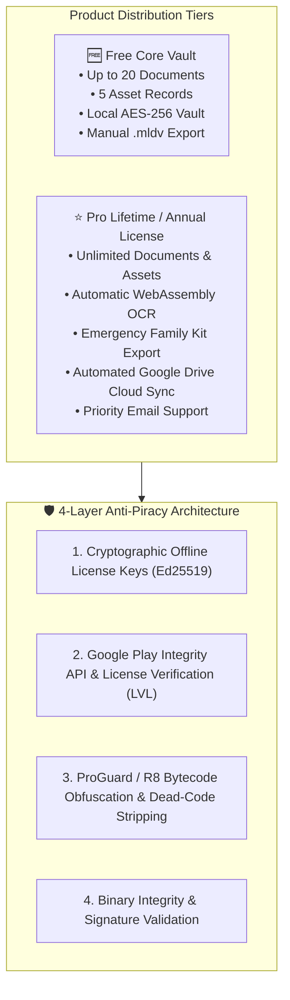
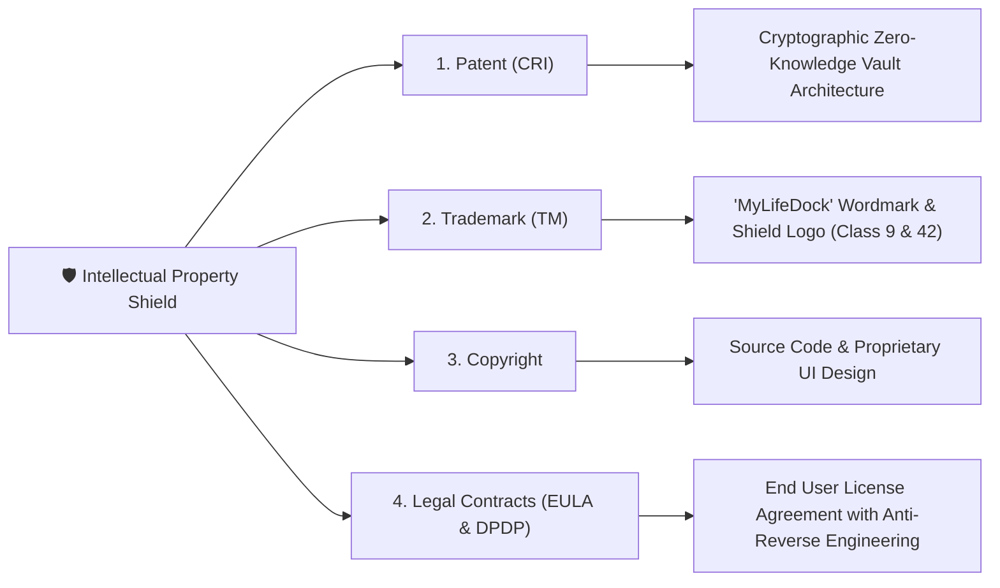
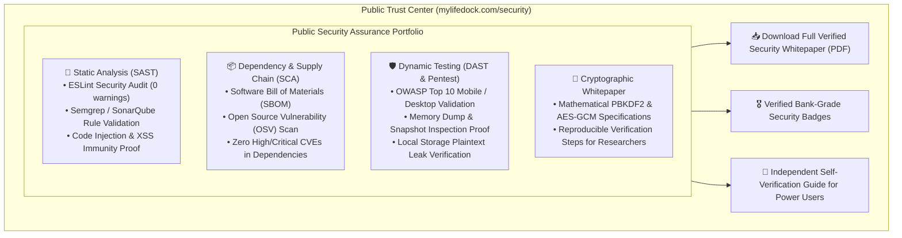

# 🧭 MyLifeDock: Future Scope, Monetization, Anti-Piracy & Legal Strategy
**Document Ref:** MLD-STRAT-V1.0  
**Classification:** Product Roadmap, Commercial Strategy, Anti-Tamper & IP Protection  
**Author:** MyLifeDock Strategic Engineering  
**Status:** Reserved for Future Implementation  

---

## 🎯 Executive Summary & Purpose

This document addresses three critical operational, commercial, and legal pillars required to transform MyLifeDock from a developed product into a secure, protected, and profitable commercial venture:



---

# 🛡️ Pillar 1: Zero-Data-Loss In-Place Update & Patching Architecture

When a user reports a bug, you will release a new patch or version (e.g. `v1.0.1` or `v1.1.0`). **The user must be able to install this update seamlessly without ever losing a single byte of their encrypted vault.**

### 1.1. How In-Place Updates Work Mechanically



### 1.2. Guaranteed Safeguards Against Data Loss

1. **Storage Separation:**
   - On Windows: The code lives in `Program Files/MyLifeDock/`, while the encrypted database lives in `%AppData%/MyLifeDock/`. Reinstalling or updating the `.exe` only touches `Program Files` and **never deletes `%AppData%`**.
   - On Android: Updating the APK/AAB via Google Play or sideload replaces the binary cache, while Android’s private app sandbox `/data/data/com.mylifedock.app/` preserves all SQLite/IndexedDB records.
2. **Dexie.js Schema Versioning:**
   - Every database change must increment `db.version(2)`, `db.version(3)` with explicit upgrade functions.
   - Example pattern:
     ```typescript
     db.version(2).stores({
       documents: 'id, category, createdAt', // updated indexes
       newFeatureTable: 'id, title, timestamp' // new table added cleanly
     }).upgrade(tx => {
       // Optional: transform existing rows without data loss
     });
     ```
3. **Automated Pre-Update Safety Snapshot:**
   - Before applying any database schema migration, the app silently creates an encrypted backup snapshot named `MyLifeDock_AutoSafetyBackup_PreV2.mldv` in the OS directory.
   - If a migration ever crashes halfway, the app detects the error, rolls back the transaction, and prompts the user to restore the pre-migration snapshot.

---

# 💰 Pillar 2: Monetization, Anti-Piracy & Anti-Tamper Protection

### 2.1. The Threat: Modded APKs & Black-Market Sideloading
If an app contains all "Pro" features inside the client code without protection, bad actors can decompile the `.apk` using tools like `apktool`, flip a boolean `isPro = true`, re-sign the APK, and distribute cracked copies on pirate forums.

### 2.2. Recommended Commercial Licensing Strategy



### 2.3. Anti-Piracy Implementation Details

#### Layer 1: Asymmetric Cryptographic License Keys (Offline & Uncrackable)
- **How it works:** You hold a **Private Signing Key (Ed25519)** on your computer. The app embeds only your **Public Verification Key**.
- When a user buys a license on your website (via Stripe / LemonSqueezy / Gumroad), your payment webhook generates a cryptographically signed license payload:
  ```json
  {
    "email": "user@example.com",
    "tier": "lifetime_pro",
    "issuedAt": "2026-08-30",
    "signature": "3a8f7c9e1b2..."
  }
  ```
- **Why this cannot be cracked:** Even if a hacker modifies the license text, the Ed25519 mathematical signature becomes invalid. Without your secret private key, no one on Earth can generate a valid license key!

#### Layer 2: Google Play Integrity API (Android)
- For the Google Play Store version, Google's **Play Integrity API** cryptographically verifies that:
  1. The app binary was genuinely installed from Google Play (not sideloaded or modded).
  2. The device is not rooted with memory injection tools running.
  3. The app signature matches your official Google Play release certificate.

#### Layer 3: Code Obfuscation & Anti-Decompilation
- **Android:** Enable `minifyEnabled true` and `shrinkResources true` in `android/app/build.gradle` using **ProGuard / R8**. This renames all variable and function names into random obfuscated symbols (`a()`, `b.c()`), making reverse-engineering near impossible.
- **Desktop (Windows/macOS):** Tauri compiles the core logic into native machine code (Rust binary) with symbol stripping (`cargo build --release`).

---

# ⚖️ Pillar 3: Legal Blueprint, Patents & Intellectual Property (India & Global)

To ensure no competitor or large company can copy your concept, branding, or implementation:



### 3.1. Patent Strategy: Computer-Related Inventions (CRI)

#### India (Indian Patent Office - IPO):
- **Law:** Under Section 3(k) of the Indian Patents Act 1970, "a mathematical or business method or a computer programme per se or algorithms" are not patentable.
- **How to Successfully Patent MyLifeDock:** The patent must be drafted as a **"System and Method for Hardware-Isolated Zero-Knowledge Ephemeral Encryption and Autonomous On-Device Asset Ingestion"**.
- **Key Patentable Claims:**
  1. The specific method of client-side key derivation combined with ephemeral in-memory key disposal on inactivity triggers.
  2. The unique pipeline linking client-side WebAssembly OCR extraction directly to encrypted envelope storage without unencrypted disk intermediate files.
  3. The multi-tiered zero-knowledge recovery protocol using pre-computed deterministic cryptographic recovery sheets.
- **Filing Process:**
  1. File a **Provisional Patent Application** (secures your official priority date immediately; cost is low: ~₹1,600 government fee for individuals/startups).
  2. You get **12 months** to file the Complete Specification while freely marketing your product as **"Patent Pending"**.

#### International (WIPO PCT Application):
- Filing a **PCT (Patent Cooperation Treaty) Application** within 12 months of your Indian filing extends your patent priority protection across **157 countries** (USA, UK, EU, Japan, etc.).

---

### 3.2. Trademark Registration (TM & ®)

- **What to protect:**
  1. The brand name: **"MyLifeDock"** (Wordmark).
  2. The logo: The blue/white shield with keylock/checkmark (Devicemark).
- **Classification (Nice Classes):**
  - **Class 9:** Computer software, downloadable mobile applications, security software for personal and financial data management.
  - **Class 42:** Software as a service (SaaS), cloud storage encryption services, technology advisory.
- **Filing:** File via [ipindiaonline.gov.in](https://ipindiaonline.gov.in) (~₹4,500 government fee per class for startups/individuals). Once filed, you can immediately start using the **™** symbol!

---

### 3.3. Source Code Copyright

- Source code, software schemas, and graphic layouts are protectable under the **Copyright Act, 1957** as "Literary Works".
- You can register the source code with the Indian Copyright Office by submitting the first and last 20 pages of source code.

---

---

# 🔍 Pillar 4: Customer Trust, Security Transparency & Public Audit Reports

To convince customers, security-conscious individuals, and enterprise users that MyLifeDock is truly bank-grade and secure, we will provide **genuine, downloadable security scan reports and cryptographic audit proofs** on our public website and within the app.



### 4.1. The 4 Security Reports to Publish

1. **SAST Report (Static Application Security Testing):**
   - Clean export of `eslint-plugin-security` and Semgrep scans certifying zero code injection sinks, zero insecure regex patterns (ReDoS-free), and strict TypeScript typing.
2. **SCA Report (Software Composition Analysis / SBOM):**
   - Software Bill of Materials detailing all open-source packages (Dexie, Tesseract.js, Tauri, Capacitor) and verifying zero unpatched critical CVEs.
3. **DAST & Memory Dump Attestation:**
   - Proof that when the app is locked or running, memory inspection tools cannot find plaintext master passphrases or unencrypted document buffers.
4. **Independent Cryptographic Audit Whitepaper:**
   - Detailed mathematical breakdown of the 100,000-round PBKDF2 key derivation and AES-256-GCM authenticated encryption scheme with reproducible test vectors.

### 4.2. Implementation Strategy (When Activated):
- Host a dedicated **`/security` Trust Center** page on the marketing website.
- Include a direct link inside the app under `ℹ️ About & Support` -> *"View Security Scan Reports & Cryptographic Attestation"*.
- Provide step-by-step instructions for security researchers on how to inspect local IndexedDB storage and verify zero unencrypted data exists.

---

## 📅 Future Implementation Roadmap (When Ready to Activate)

| Phase | Milestone | Actions & Deliverables |
| :--- | :--- | :--- |
| **Phase A** | **IP & Trademark Filing** | File Trademark for "MyLifeDock" (Class 9/42) and file Provisional Patent for Cryptographic Ingestion Architecture. |
| **Phase B** | **Public Security Whitepaper & Scan Reports** | Generate downloadable PDF security dossier (SAST, SCA, Cryptographic proof) for the public Trust Center. |
| **Phase C** | **Anti-Tamper & Obfuscation** | Enable ProGuard / R8 rules in Android build and binary stripping in Tauri desktop. |
| **Phase D** | **Commercial Licensing Engine** | Implement offline Ed25519 license key verifier and LemonSqueezy/Stripe automated key issuance webhook. |
| **Phase E** | **In-App Billing (Google Play)** | Connect `@capacitor/google-play-billing` for one-tap in-app upgrades on Android. |

