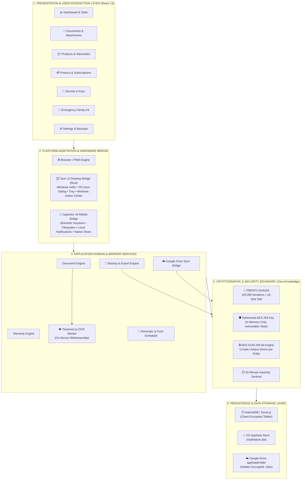
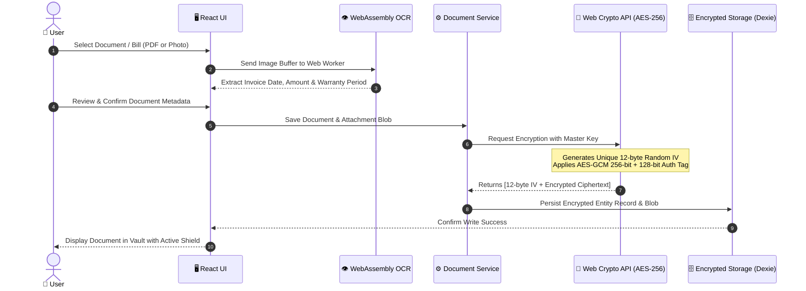
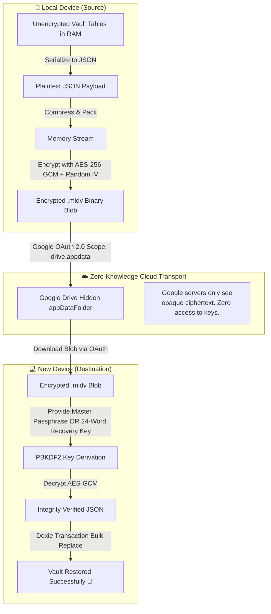
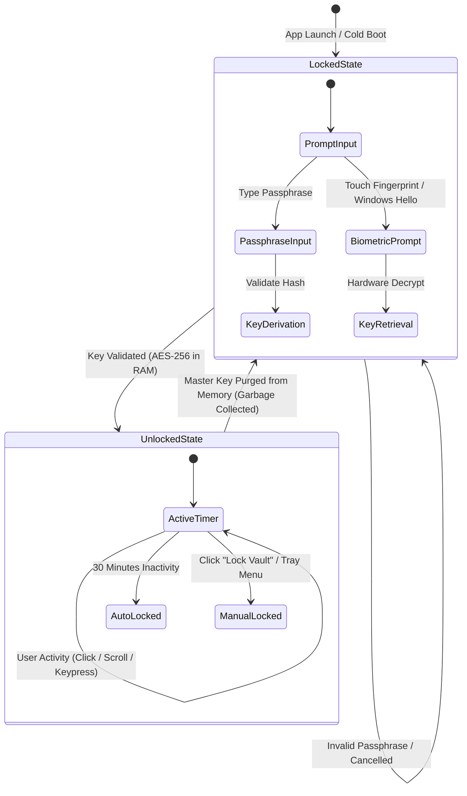

# 🏛️ MyLifeDock Product Architecture & Technical Specifications
**Document Ref:** MLD-ARCH-V1.0  
**Classification:** Technical Architecture, Security Model & System Topology  
**Security Level:** Zero-Knowledge, Client-Side AES-256-GCM, 100% Offline-First  

---

## 🌐 1. Complete System Architecture Overview (High-Level View)

The following diagram illustrates the complete end-to-end architecture of MyLifeDock across all platforms, abstraction layers, hardware bridges, and security boundaries.

---

## 🔒 2. Data Flow Diagram: Ingestion & Encryption (Level 1 DFD)

This diagram details the exact cryptographic lifecycle of documents, metadata, and binary attachments from the moment the user selects a file.

---

## 🔄 3. Zero-Knowledge Cloud Sync & Recovery Dataflow

---

## ⏱️ 4. Vault Lifecycle & Auto-Lock State Machine

---

## ⚙️ 5. Technical Specifications Matrix

| Dimension | Specification | Standard / Compliance |
| :--- | :--- | :--- |
| **Symmetric Encryption** | AES-256-GCM (Galois/Counter Mode) | FIPS 197 / NIST SP 800-38D |
| **Key Derivation** | PBKDF2-HMAC-SHA256 (100,000 rounds) | NIST SP 800-132 |
| **Nonce / IV Generation** | Cryptographically Secure CSPRNG (`crypto.getRandomValues`) | 96-bit (12 bytes) unique per operation |
| **Integrity Tag** | 128-bit Authentication Tag | AEAD (Authenticated Encryption) |
| **Client Memory Model** | Ephemeral Non-Extractable CryptoKey | Web Crypto API (`extractable: false`) |
| **OCR Processing** | Tesseract.js (WebAssembly on-device) | 100% Offline, Zero Cloud Telemetry |
| **Desktop Shell** | Tauri v2 (Rust 2021, Webview2 / WKWebView) | Memory-safe, ~3.4 MB bundle footprint |
| **Mobile Shell** | Capacitor v8 (Android / iOS) | Android Keystore / Apple Keychain isolation |
