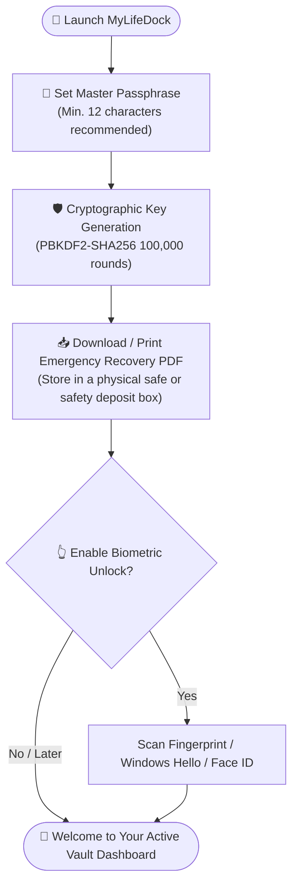
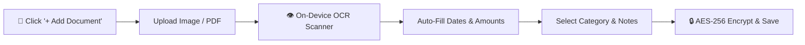
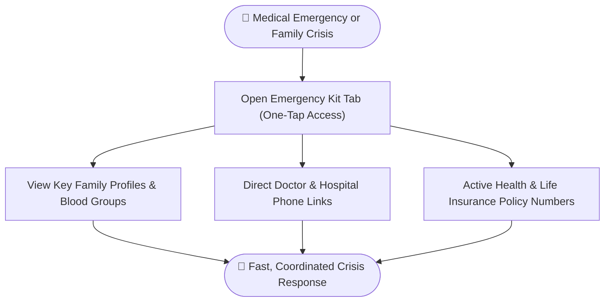
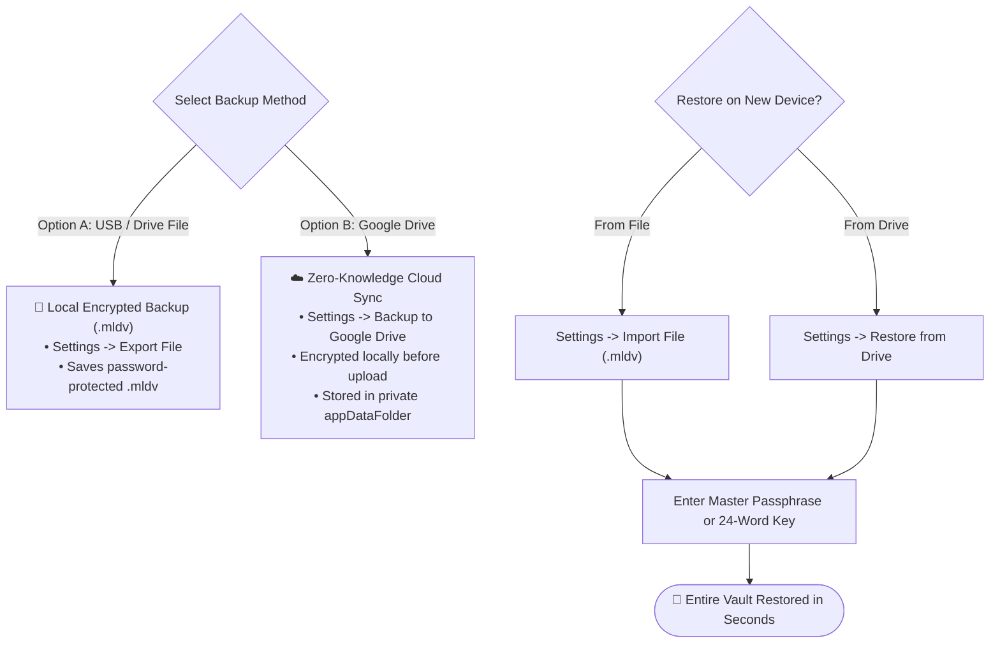

# 📘 MyLifeDock User Handbook & Operational Manual
**Version:** 1.0.0 (Production Release)  
**Security Model:** Zero-Knowledge, Client-Side AES-256-GCM Encrypted, 100% Offline-First  
**Supported Platforms:** Windows (x64 Setup / MSI), macOS (DMG), Android (APK / AAB), iOS, Web (PWA)

---

## 🌟 1. Introduction: What is MyLifeDock?

**MyLifeDock** is your personal, family, and asset management digital safe. Unlike traditional cloud services where third parties or employees can read your records, **MyLifeDock is built on a Zero-Knowledge Architecture**:
- 🔒 **All records and attachments are encrypted locally** on your device using **AES-256-GCM** before touching storage.
- 🔑 **Only your master passphrase or 24-word recovery key can decrypt your vault.**
- 🛡️ **Zero Cloud Tracking:** No central server stores your data, emails, passwords, or personal documents.

---

## 🚀 2. Quick Start: Initial Setup Flowchart

### Step 1: Initialize Your Master Passphrase
1. When you first launch MyLifeDock, you will be prompted to choose a **Master Passphrase**.
2. Pick a strong passphrase (at least 12 characters recommended, including letters, numbers, and symbols).
3. Confirm your passphrase.

### Step 2: Save Your Emergency Recovery PDF / Key
1. The app generates a cryptographic **Emergency Recovery Key**.
2. **Download or print your Emergency Recovery PDF**. Store it in a safe place (e.g., a physical safe or safety deposit box).
3. If you forget your passphrase, this recovery key is the **only way** to restore access to your vault.

### Step 3: Enable Biometric Unlock (Optional & Recommended)
1. Go to **Settings** (`⚙️`).
2. Under **Biometric Unlock**, click **Enable Biometric Unlock**.
3. Type your master passphrase once to authorize hardware integration.
4. Scan your **Fingerprint, Face ID, or Windows Hello / Touch ID**.
5. Subsequent vault unlocks will only require a quick biometric touch!

---

## 📂 3. Feature Operations & Visual Workflows

### 📄 3.1. Adding a Document with Smart OCR (Workflow)

- **Organize Life Documents:** Categorized by Identity (Passports, National IDs), Medical, Property Deeds, Legal/Tax, Education, Employment, and Estate Planning.
- **Client-Side Encrypted Attachments (📎):** Attach PDFs, photos, and scans. Every file is encrypted in memory using AES-256-GCM with distinct IVs before storage.
- **On-Demand Lightbox Preview & Sharing:** Preview PDFs and images directly within the app without saving plaintext copies to your disk.
- **Instant Optical Character Recognition (OCR):** Uploading receipts or invoices extracts warranty dates, amounts, and dates automatically.

---

### 🚨 3.2. Emergency Family Access Kit (Crisis Response Flow)

- **One-Tap Emergency Access:** Summarizes emergency contacts, blood groups, primary physicians, hospital affiliations, and active insurance policies.
- **Offline Reliability:** Accessible even during network outages or cellular downtime.

---

### 🚗 3.3. Products, Vehicles & Property Management
- **Products & Warranties:** Track gadgets and appliances with automatic warranty status indicators (*Active*, *Expiring Soon*, *Expired*).
- **Vehicles:** Log registration numbers, VINs, insurance policy details, road tax due dates, and maintenance records.
- **Properties:** Store title deeds, mortgage details, annual property tax schedules, and maintenance records.

---

### 💳 3.4. Finances & Digital Secrets
- **Finances:** Secure account numbers, IFSC/SWIFT codes, and card expirations.
- **Recurring Subscriptions:** Monthly and yearly subscription spend tracking with renewal alerts.
- **Digital Secrets & Master Keys:** Wi-Fi keys, server passwords, and backup seeds with masked fields and temporary clipboard copy protection.

---

## 🔄 4. Backup & Disaster Recovery Decision Guide

---

## 🔒 5. Security Best Practices & FAQ

| Question | Recommended Action / Guarantee |
| :--- | :--- |
| **What happens if I lose my Master Passphrase?** | Use your **Emergency Recovery PDF / 24-Word Key** to reset access. Because MyLifeDock is zero-knowledge, no customer support team can reset your password for you. |
| **Can Google read my cloud backup?** | **No.** The `.mldv` file is encrypted on your device using AES-256-GCM *before* transmission. Google only sees an opaque binary blob. |
| **How does Auto-Lock protect me?** | If you step away from your device for 30 minutes, MyLifeDock wipes the AES-256 encryption key from RAM. Returning requires your passphrase or biometric touch. |
| **Can I use MyLifeDock on an airplane / offline?** | **Yes.** MyLifeDock is 100% offline-first. All core features, search, OCR, and document viewers work without an internet connection. |
